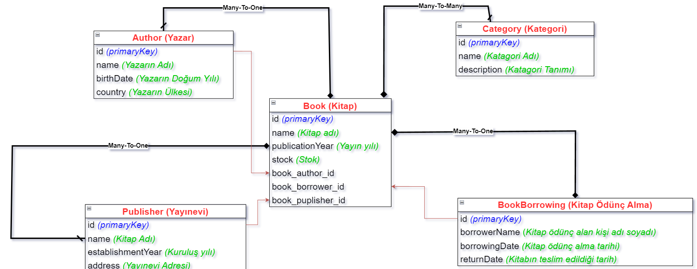

<h1 align="center">Kütüphane Yönetim Sistemleri</h1>
<h3 align="center">Bu proje, bir kütüphane yönetim sistemi için temel bir uygulama sunmaktadır. Java ve Jakarta Persistence API (JPA) kullanarak, yazarlar, yayınevleri, kitaplar, kategoriler ve kitap ödünç işlemleri gibi kütüphane verilerini yönetir.</h3>  

<br/>

<p align="center"> 
  
</p>

<!-- TABLE OF CONTENTS -->
<h2 id="table-of-contents"> :book: İçerik</h2>

<details open="open">
  <summary>İçerik</summary>
  <ol>
    <li><a href="#proje-ozeti"> ➤ Proje Özeti</a></li>
    <li><a href="#teknolojiler"> ➤ Kullanılan Teknolojiler</a></li>
    <li><a href="#kurulum"> ➤ Kurulum ve Başlatma</a></li>
    <li><a href="#sistem-gorselleri"> ➤ Program İçi Görseller</a></li>
    <li><a href="#iletisim"> ➤ İletişim</a></li>
  </ol>
</details>


<!-- PROJECT OVERVIEW -->
<h2 id="proje-ozeti"> :mag_right: Proje Özeti</h2>

<p align="justify"> 
Kütüphane Yönetim Sistemi, kütüphaneler için kapsamlı ve etkin bir yönetim çözümü sunmayı hedefleyen bir uygulamadır. Bu sistem, kitapları, yazarları, kategorileri ve ödünç alma işlemlerini yönetmek için geliştirilmiştir. Kullanıcılar, kütüphanedeki kitapları ve yazarları dijital ortamda kolayca yönetebilir, kitap ödünç alma işlemlerini gerçekleştirebilirler.

### Ana Özellikler:
- **Yazar Yönetimi:** Yazar bilgilerini ekleme, güncelleme ve silme işlemleri yapılabilir. Yazarların doğum tarihi ve ülke bilgileri gibi detaylar saklanır.
- **Kitap Yönetimi:** Kitaplar, yazarlar ve kategorilerle ilişkilendirilir. Kitapların detayları, kategorileri ve yazarları hakkında bilgi sağlanır. Ayrıca kitapların eklenmesi, güncellenmesi ve silinmesi işlemleri yapılabilir.
- **Kategori Yönetimi:** Kitapların kategorileri yönetilir. Kategoriler, kitapların sınıflandırılmasına yardımcı olur ve kitapların belirli kategorilere göre düzenlenmesini sağlar.
- **Ödünç Alma İşlemleri:** Kitapların ödünç alınması ve geri iade edilmesi işlemleri yönetilir. Kullanıcılar ödünç aldıkları kitapları takip edebilir ve iade tarihlerini görebilirler.

## Kullanılan Teknolojiler

Projede kullanılan teknolojiler:
- **Java:** Projenin ana programlama dili olarak kullanılmıştır.
- **Hibernate:** ORM (Object-Relational Mapping) çerçevesi olarak veritabanı işlemleri yönetilir.
- **PostgreSQL:** Veritabanı yönetim sistemi olarak kullanılır.
- **Spring Boot:** Projenin yapılandırılması ve RESTful API'lerin yönetimi için kullanılmıştır.


</p>


<!-- USED TECHNOLOGIES -->
<h2 id="teknolojiler"> :computer: Kullanılan Teknolojiler</h2>

<p align="justify"> 
Projede kullanılan teknolojiler:

[](https://www.java.com/tr/) <br>
[](https://www.java.com/tr/) <br>
[](https://www.mysql.com/) <br>
[](https://www.python.org/) <br>

</p>


<!-- SETUP AND LAUNCH -->
<h2 id="kurulum"> :hammer: Kurulum ve Başlatma</h2>

<p align="justify"> 
Projeyi  klonlamak ve çalıştırmak için aşağıdaki adımları takip edin:

```bash
git clone https://github.com/behcetmuhammed/Library-Management-Systems.git
cd Library-Management-Systems
```
Projeyi IDE'nizde açın ve `Main` sınıfını çalıştırın.
</p>

<h3 id="kurulum"> :warning: Uyarı: Bu proje, `JDK 18 Amazon Corretto 18.0.2` ile uyumludur. Lütfen bu JDK sürümünü kullanarak projeyi çalıştırın.</h3>


<!-- PROGRAM SCREENSHOTS -->
<h2 id="sistem-gorselleri"> :camera: Program İçi Görseller</h2>

<p align="justify"> 

### Login Ekranı

</p>


<!-- CONTACT -->
<h2 id="iletisim"> :phone: İletişim ve Bilgiler</h2>

<p>
✤ <a href="https://www.linkedin.com/in/emir-muhammed/">LinkedIn</a> <br>
✤ <a href="https://github.com/behcetmuhammed">emiraydemirsyr@gmail.com</a> <br>
</p>
